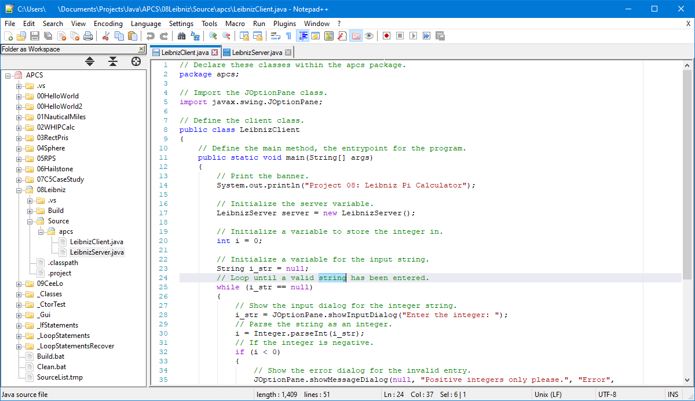
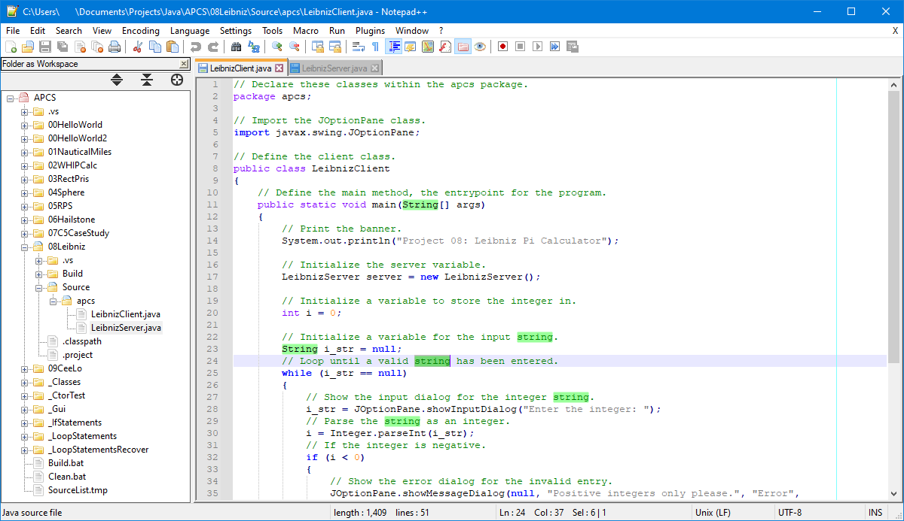
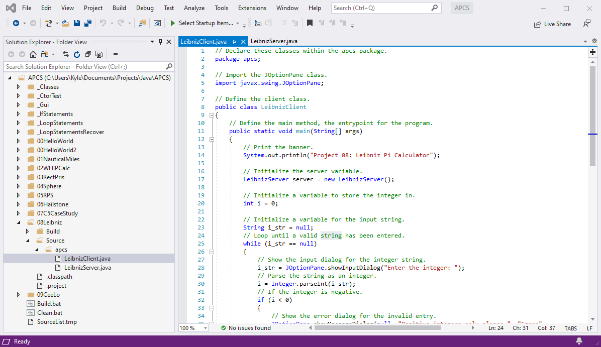

# VS2019-Light-Npp
This is a theme made to loosely match the color scheme of Visual Studio 2019's light theme.

Supported parts of the theme are:
- General
- Java

## Screenshots
Screenshot of Notepad++ with the VS2019-Light-NPP theme:

Screenshot of Notepad++ with the default theme:

Screenshot of Visual Studio 2019 with the default light theme:

## Other Themes
For related themes see [VS2019-Dark-Npp](https://github.com/hellon8/VS2019-Dark-Npp), [VS2015-Dark-Npp](https://github.com/cydh/VS2015-Dark-Npp), and [Npp-VS2012-Dark](https://github.com/SeanCline/Npp-VS2012-Dark). This theme is based off of [this](https://web.archive.org/web/20130702221611/http://www.shilony.net/2012/09/02/notepad-visual-studio-theme) Notepad++ Visual Studio Theme.

## Usage
For usage information see the readmes of the related projects.

## License
This theme is licensed under the [Unlicense](https://unlicense.org/).